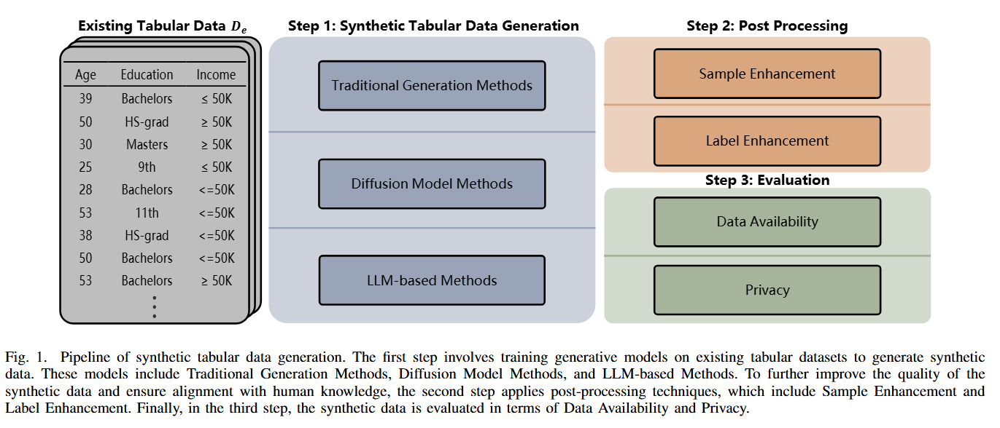
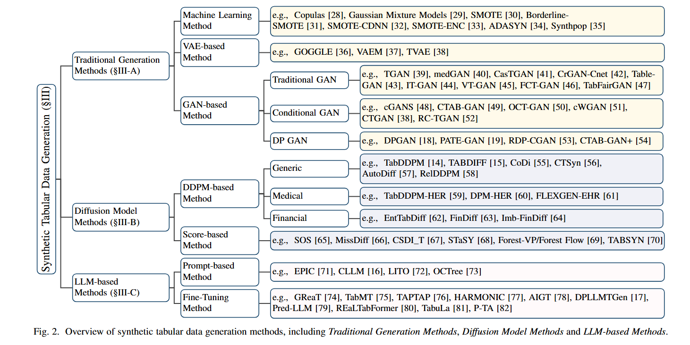
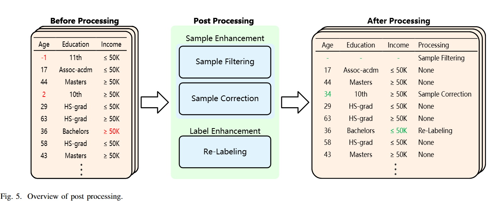

# Awesome-Synthetic-Tabular-Data-Generation
## Our works

🔥🔥🔥 **A Comprehensive Survey of Synthetic Tabular Data Generation** **[Paper](https://arxiv.org/pdf/2504.16506)**

    

The first comprehensive survey for Synthetic Tabular Data Generation. 

---

<b> Table of Contents </b> 

- [Awesome Snthetic Tabular Data Generation Papers](#awesome-snthetic-tabular-data-generation-papers)
  - [Traditional Generation Methods](#traditional-generation-methods) 
    - [Machine Learning Method](#machine-learning-method)
    - [VAE-based Method](#VAE-based-method)
    - [GAN-based Method](#GAN-based-method)
  - [Diffusion Model Methods](#diffusion-model-methods) 
    - [DDPM-based Method](#machine-learning-method)
    - [Score-based Method](#score-based-method)
  - [LLM-based Methods](#LLM-based-methods) 
    - [Prompt-based Method](#prompt-based-method)
    - [Fine-Tuning Method](#fine-tuning-method) 
- [Awesome Post Processing Papers](#awesome-post-processing-papers)
  - [Sample Enhancement](#sample-enhancement) 
    - [Sample Filtering](#sample-filtering)
    - [Sample Correction](#sample-correction)
  - [Label Enhancement](#label-enhancement)
- [Awesome Datasets](#awesome-datasets)

---
# Awesome Snthetic Tabular Data Generation Papers

    

## Traditional Generation Methods

### Machine Learning Method
| Title                                                                                                                                                                                                                                                               | Model  | Venue |   Date   | Code |
|:--------------------------------------------------------------------------------------------------------------------------------------------------------------------------------------------------------------------------------------------------------------------|:------:|:-----:|:--------:|:----:|
| [**Random variables, joint distribution functions, and copulas**](https://dml.cz/bitstream/handle/10338.dmlcz/125838/Kybernetika_09-1973-6_2.pdf)                                                                                                                   | Copula |   Kybernetika    |   1973   |  -   |
| [**synthpop: Bespoke creation of synthetic data in r**](https://www.jstatsoft.org/article/view/v074i11/0)                                                                                                                                                           | Synthpop       |  JSS     |   2016   |  -   |
| [**SMOTE: Synthetic Minority Over-sampling Technique**](https://dl.acm.org/doi/abs/10.5555/1622407.1622416)                                                                                                                                                         | SMOTE       |  JAIR     |   2002   |  -   |
| [**Borderline-smote: a new oversampling method in imbalanced data sets learning**](https://link.springer.com/chapter/10.1007/11538059_91)                                                                                                                           | Borderline-SMOTE       |  ICIC     |   2005   |  -   |
| [**Adasyn: Adaptive synthetic sampling approach for imbalanced learning**](https://ieeexplore.ieee.org/abstract/document/4633969)                                                                                                                                   | ADASYN       |  IJCNN     |   2008   |  -   |
|    [**SMOTE-ENC: A Novel SMOTE-Based Method to Generate Synthetic Data for Nominal and Continuous Features**](https://www.mdpi.com/2571-5577/4/1/18)              | SMOTE-ENC       |  Applied System Innovation     |   2021   |  [Github](https://mkhushi.github.io/)   |
|    [**Synthetic minority oversampling using edited displacement-based k-nearest neighbors**](https://www.sciencedirect.com/science/article/pii/S1568494623009134) | SMOTE-CDNN       |  Applied Soft Computing     |   2023   |  [Github](https://github.com/coksvictoria/SMOTE-CDNN)   |

### VAE-based Method
| Title                                                                                                                                                                                                                                                             |        Model         | Venue |   Date   | Code |
|:------------------------------------------------------------------------------------------------------------------------------------------------------------------------------------------------------------------------------------------------------------------|:--------------------:|:-----:|:--------:|:----:|
|    [**Modeling Tabular Data using Conditional GAN**](https://proceedings.neurips.cc/paper/2019/hash/254ed7d2de3b23ab10936522dd547b78-Abstract.html)                      |         TVAE         |   NeurIPS     |   2019   |  [Github](https://github.com/DAI-Lab/CTGAN)   |
|    [**VAEM: a Deep Generative Model for Heterogeneous Mixed Type Data**](https://proceedings.neurips.cc/paper/2020/hash/8171ac2c5544a5cb54ac0f38bf477af4-Abstract.html) |       VAEM      |  NeurIPS     |   2020    |  [Github](https://github.com/microsoft/VAEM)   |
|    [**GOGGLE: GENERATIVE MODELLING FOR TABULAR DATA BY LEARNING RELATIONAL STRUCTURE**](https://openreview.net/forum?id=fPVRcJqspu)                                     |        GOGGLE         |  ICLR    |   2023   |  [Github](https://github.com/vanderschaarlab/GOGGLE)   |

### GAN-based Method
| Title                                                                                                                                                                                                                                                                                                                                                                                                                   |         Model         |    Venue    | Date |                                         Code                                         |
|:------------------------------------------------------------------------------------------------------------------------------------------------------------------------------------------------------------------------------------------------------------------------------------------------------------------------------------------------------------------------------------------------------------------------|:---------------------:|:-----------:|:----:|:------------------------------------------------------------------------------------:|
|    [**Generating multi-label discrete patient records using generative adversarial networks**](https://openreview.net/forum?id=yxh2a1yxc3)                                                                                                                                                                                     |        medGAN         |    MLHC     | 2017 |                      [Github](https://github.com/mp2893/medgan)                      |
| [**Synthesizing Tabular Data using Generative Adversarial Networks**](https://arxiv.org/pdf/1811.11264)                                                                                                                                                                                                                                                                                                                 |         TGAN          |    arXiv    | 2018 |                                          -                                           |
| [**Airline Passenger Name Record Generation using Generative Adversarial Networks**](https://arxiv.org/abs/1807.06657)                                                                                                                                                                                                                                                                                                  |        CrGAN-Cnet         |    arXiv    | 2018 | [Dropbox](https://www.dropbox.com/sh/11c5mo0f7g42wgs/AACm7xaRdyZdzMo2NgCPIrPja?dl=0) |
|    [**Data synthesis based on generative adversarial networks**](https://dl.acm.org/doi/pdf/10.14778/3231751.3231757)                                                                                                                                                                                                     |        TableGAN         |    PVLDB    | 2018 |                   [Github](https://github.com/mahmoodm2/tableGAN)                    |
| [**Invertible Tabular GANs: Killing Two Birds with OneStone for Tabular Data Synthesis**](https://proceedings.neurips.cc/paper/2021/hash/22456f4b545572855c766df5eefc9832-Abstract.html)                                                                                                                                                                                                                                |         IT-GAN          |   NeurIPS   | 2021 |                                          -                                           |
| [**FCT-GAN: Enhancing Table Synthesis via Fourier Transform**](https://arxiv.org/pdf/2210.06239v1)                                                                                                                                                                                                                                                                                                                      |        FCT-GAN         |    arXiv    | 2022 |                                          -                                           |
|    [**TabFairGAN: Fair Tabular Data Generation with Generative Adversarial Networks**](https://www.mdpi.com/2504-4990/4/2/22)                                                                                                                                                                                       |        TabFairGAN        |    MAKE     | 2022 |                [Github](https://github.com/amirarsalan90/TabFairGAN)                 |
| [**VT-GAN: Cooperative Tabular Data Synthesis using Vertical Federated Learning**](https://arxiv.org/abs/2302.01706)                                                                                                                                                                                                                                                                                                    |        VT-GAN        |    arXiv    | 2023 |                                          -                                           |
|    [**CasTGAN: Cascaded Generative Adversarial Network for Realistic Tabular Data Synthesis**](https://ieeexplore.ieee.org/abstract/document/10410850)                                                                                                                                                                   |        CasTGAN        |    IEEE Access    | 2024 |                   [Github](https://github.com/abedshantti/CasTGAN)                   |
|    [**Effective data generation for imbalanced learning using conditional generative adversarial network**](https://www.sciencedirect.com/science/article/pii/S0957417417306346)                                                                                                                         |        cGANS         |    EXPERT SYST APPL    | 2018 |           [Github](https://github.com/gdouzas/generative-adversarial-nets)           |
|    [**Modeling Tabular Data using Conditional GAN**](https://proceedings.neurips.cc/paper/2019/hash/254ed7d2de3b23ab10936522dd547b78-Abstract.html)                                                                                                                                                                            |        CTGAN         |    NeurIPS    | 2019 |                      [Github](https://github.com/DAI-Lab/CTGAN)                      |
|    [**Conditional Wasserstein GAN-based Oversampling of Tabular Data for Imbalanced Learning**](https://arxiv.org/abs/2008.09202)                                                                                                                                                                       |        cWGAN         |    EXPERT SYST APPL    | 2020 |          [Github](https://github.com/justinengelmann/GANbasedOversampling)           |
| [**CTAB-GAN: Effective Table Data Synthesizing**](https://www.arxiv.org/abs/2102.08369)                                                                                                                                                                                                                                                                                                                                 |        CTAB-GAN         |    ACML    | 2021 |                                          -                                           |
| [**OCT-GAN: Neural ODE-based Conditional Tabular GANs**](https://dl.acm.org/doi/pdf/10.1145/3442381.3449999)                                                                                                                                                                                                                                                                                                            |        OCT-GAN         |    WWW    | 2021 |                                          -                                           |
| [**Row Conditional-TGAN for Generating Synthetic Relational Databases**](https://ieeexplore.ieee.org/abstract/document/10096001)                                                                                                                                                                                                                                                                                        |        RC-TGAN         |    ICASSP    | 2023 |                                          -                                           |
|    [**Differentially Private Generative Adversarial Network**](https://arxiv.org/abs/1802.06739)                                                                                                                                                                                                                            |        DPGAN         |    arXiv    | 2018  |                    [Github](https://github.com/illidanlab/dpgan)                     |
|    [**Pate-gan: Generating synthetic data with differential privacy guarantees**](https://openreview.net/forum?id=S1zk9iRqF7&utm_source=se%D1%20uritylabru)                                                                                                                                                                                                         |        PATE-GAN         |    ICLR    | 2019  | [Github](https://github.com/vanderschaarlab/mlforhealthlabpub/tree/main/alg/pategan) |
| [**Differentially private synthetic medical data generation using convolutional gans**](https://www.sciencedirect.com/science/article/pii/S0020025521012391)                                                                                                                                                                                                         |        RDP-CGAN         |    Information Sciences    | 2022  |                                          -                                           |
|    [**CTAB-GAN+: enhancing tabular data synthesis**](https://www.frontiersin.org/journals/big-data/articles/10.3389/fdata.2023.1296508/full)                                                                                                                                                                                                         |        CTAB-GAN+         |    Frontiers Big Data    | 2024   |                                          [Github](https://github.com/Team-TUD/CTAB-GAN-Plus-DP)                                           |

## Diffusion Model Methods

### DDPM-based Method
| Title                                                                                                                                                                                                                                                                                                                                           |    Model    |    Venue    | Date |                                Code                                |
|:------------------------------------------------------------------------------------------------------------------------------------------------------------------------------------------------------------------------------------------------------------------------------------------------------------------------------------------------|:-----------:|:-----------:|:----:|:------------------------------------------------------------------:|
|    [**TabDDPM: Modelling Tabular Data with Diffusion Models**](https://proceedings.mlr.press/v202/kotelnikov23a.html)                                                                                                                       |   TabDDPM   |    ICML     | 2023 |       [Github](https://github.com/yandex-research/tab-ddpm)        |
|    [**CoDi: Co-evolving Contrastive Diffusion Models for Mixed-type Tabular Synthesis**](https://proceedings.mlr.press/v202/lee23i.html)                                                                                                           |    CoDi     |    ICML    | 2023 |           [Github](https://github.com/ChaejeongLee/CoDi)           |
|    [**AutoDiff: combining Auto-encoder and Diffusion model for tabular data synthesizing**](https://openreview.net/forum?id=XhxOCXlXSh)                                                                                        |  AutoDiff   |    SyntheticData4ML    | 2018 | [Github](https://github.com/UCLA-Trustworthy-AI-Lab/AutoDiffusion) |
|    [**Controllable Tabular Data Synthesis Using Diffusion Models**](https://dl.acm.org/doi/10.1145/3639283)                                                                                                                                      |   RelDDPM   |   Proc. ACM Manag. Data   | 2024 |          [Github](https://github.com/ruc-datalab/RelDDPM)          |
| [**CTSyn: A Foundational Model for Cross Tabular Data Generation**](https://arxiv.org/abs/2406.04619)                                                                                                                                                                                                                                           |    CTSyn    |   ICLR   | 2025 |                                 -                                  |
|    [**TABDIFF: A MULTI-MODAL DIFFUSION MODEL FOR TABULAR DATA GENERATION**](https://arxiv.org/pdf/2410.20626)                                                                                                                                       |   TABDIFF   |   ICLR   | 2025 |           [Github](https://github.com/MinkaiXu/TabDiff)            |
| [**Synthesizing mixed-type electronic health records using diffusion models**](https://arxiv.org/abs/2302.14679)                                                                                                                                                                                                                                | TabDDPM-EHR |   arXiv    | 2023 |                                 -                                  |
|    [**Synthetic health-related longitudinal data with mixed-type variables generated using diffusion models**](https://openreview.net/forum?id=1MV49Ug6q9)                                                                     |   DPM-EHR   |   SyntheticData4ML    | 2023 | [Github](https://github.com/Nic5472K/ScientificData2021_HealthGym) |
| [**A flexible generative model for heterogeneous tabular ehr with missing modality**](https://openreview.net/forum?id=W2tCmRrj7H)                                                                                                                                                                                                               | FLEXGEN-EHR |   ICLR    | 2024 |                                 -                                  |
| [**Entity-based financial tabular data synthesis with diffusion models**](https://dl.acm.org/doi/abs/10.1145/3677052.3698625)                                                                                                                                                                                                               | EntTabDiff  |   ICAIF    | 2023 |                                 -                                  |
|    [**FinDiff: Diffusion Models for Financial Tabular Data Generation**](https://dl.acm.org/doi/pdf/10.1145/3604237.3626876)                                                                                                                                                                                                               |   FinDiff   |   ICAIF    | 2024 |           [Github](https://github.com/sattarov/FinDiff)            |
| [**Imb-findiff: Conditional diffusion models for class imbalance synthesis of financial tabular data**](https://dl.acm.org/doi/abs/10.1145/3677052.3698659)                                                                                                                                                                                                               | Imb-FinDiff |   ICAIF    | 2024 |                                 -                                  |

### Score-based Method
| Title                                                                                                                                                                                                                                                                                                                                           |    Model    |        Venue        | Date |                      Code                      |
|:------------------------------------------------------------------------------------------------------------------------------------------------------------------------------------------------------------------------------------------------------------------------------------------------------------------------------------------------|:-----------:|:-------------------:|:----:|:----------------------------------------------:|
|    [**SOS: Score-based Oversampling for Tabular Data**](https://dl.acm.org/doi/abs/10.1145/3534678.3539454)                                                                                                                       |   SOS   |         KDD         | 2022 | [Github](https://github.com/JayoungKim408/SOS) |
| [**MissDiff: Training Diffusion Models on Tabular Data with Missing Values**](https://proceedings.mlr.press/v202/lee23i.html)                                                                                                           |    MissDiff     |    TRL @ NeurIPS    | 2022  |                       -                        |
|    [**Diffusion models for missing value imputation in tabular data**](https://arxiv.org/pdf/2210.17128)                                                                                                           |    CSDI_T     |    SPIGM @ ICML    | 2023  |                       [Github](https://github.com/ermongroup/CSDI)                        |
|    [**STASY: SCORE-BASED TABULAR DATA SYNTHESIS**](https://openreview.net/forum?id=1mNssCWt_v)                                                                                                           |    STaSY     |    ICLR    | 2023  |                       [Github](https://github.com/yang-song/score_sde_pytorch)                        |
|    [**Generating and Imputing Tabular Data via Diffusion and Flow-based Gradient-Boosted Trees**](https://proceedings.mlr.press/v238/jolicoeur-martineau24a.html)                                                                                                           |    Forest-VP/Forest-Flow     |    PMLR    | 2024  |                       [Github](https://github.com/SamsungSAILMontreal/ForestDiffusion)                        |
|    [**MIXED-TYPE TABULAR DATA SYNTHESIS WITH SCORE-BASED DIFFUSION IN LATENT SPACE**](https://proceedings.mlr.press/v238/jolicoeur-martineau24a.html)                                                                                                           |    TABSYN     |    ICLR    | 2024  |                       [Github](https://github.com/amazon-science/tabsyn)                        |

## LLM-based Methods

### Prompt-based Method
| Title                                                                                                                                                                                                                                                                                                                                           |    Model    |        Venue        | Date |                              Code                              |
|:------------------------------------------------------------------------------------------------------------------------------------------------------------------------------------------------------------------------------------------------------------------------------------------------------------------------------------------------|:-----------:|:-------------------:|:----:|:--------------------------------------------------------------:|
|    [**EPIC: Effective Prompting for Imbalanced-Class Data Synthesis in Tabular Data Classification via Large Language Models**](https://proceedings.neurips.cc/paper_files/paper/2024/hash/37f2f382b1e1f1e887d610e7ea047086-Abstract-Conference.html)                                                                                                                       |   EPIC   |         NeurIPS         | 2024 | [Github](https://github.com/seharanul17/synthetic-tabular-LLM) |
|    [**Curated LLM: Synergy of LLMs and Data Curation for tabular augmentation in low-data regimes**](https://arxiv.org/pdf/2312.12112)                                                                                                                       |   CLLM   |         ICML         | 2024 |       [Github](https://github.com/vanderschaarlab/CLLM)        |
| [**Language-interfaced tabular oversampling via progressive imputation and self-authentication**](https://openreview.net/forum?id=8F6bws5JBy)                                                                                                                       |   LITO    |         ICLR         | 2024 |                               -                                |

### Fine-Tuning Method
| Title                                                                                                                                                                                                                      | Model |        Venue        | Date |                      Code                       |
|:---------------------------------------------------------------------------------------------------------------------------------------------------------------------------------------------------------------------------|:-----:|:-------------------:|:----:|:-----------------------------------------------:|
|    [**LANGUAGE MODELS ARE REALISTIC TABULAR DATA GENERATORS**](https://arxiv.org/abs/2210.06280)                             | GReaT |         NeurIPS         | 2024 | [Github](https://github.com/kathrinse/be_great) |
|    [**TabuLa: Harnessing Language Models for Tabular Data Synthesis**](https://openreview.net/forum?id=2QJ92QJcNR)           | TabuLa  |         arXiv         | 2023 | [Github](https://github.com/zhao-zilong/Tabula) |
| [**TabMT: Generating tabular data with masked transformers**](https://openreview.net/forum?id=8F6bws5JBy)                                                                                                                  | TabMT  |         NeurIPS         | 2023 |                        -                        |
|    [**Generative Table Pre-training Empowers Models for Tabular Prediction**](https://aclanthology.org/2023.emnlp-main.917/) | TAPTAP  |         EMNLP         | 2023 | [Github](https://github.com/ZhangTP1996/TapTap) |
|    [**HARMONIC: Harnessing LLMs for Tabular Data Synthesis and Privacy Protection**](https://arxiv.org/abs/2408.02927)        | HARMONIC  |         NeurIPS         | 2024 | [Github](https://github.com/Wendy619/HARMONIC)  |
| [**Differentially Private Tabular Data Synthesis using Large Language Models**](https://arxiv.org/abs/2406.01457)                                                                                                          | DP-LLMTGen  |         arXiv          | 2024 |                        -                        |
| [**Generating Realistic Tabular Data with Large Language Models**](https://arxiv.org/abs/2410.21717)                                                                                                                       | Pred-LLM  |         arXiv          | 2024 |                        -                        |
|    [**P-TA: Using Proximal Policy Optimization to Enhance Tabular Data Augmentation via Large Language Models**](https://arxiv.org/pdf/2406.11391)                                                                            | P-TA  |         ACL          | 2024 |  [Github](https://github.com/ShuoYangtum/P-TA)  |
| [**AIGT: AI Generative Table Based on Prompt**](https://aclanthology.org/2025.coling-main.664/)                                                                            | AIGT |         ACL          | 2025 |                        -                        |

---
# Awesome Post Processing Papers

    

## Sample Enhancement

### Sample Filtering
| Title                                                                                                                                                                                                                      | Model |        Venue        | Date |                      Code                       |
|:---------------------------------------------------------------------------------------------------------------------------------------------------------------------------------------------------------------------------|:-----:|:-------------------:|:----:|:-----------------------------------------------:|
|    [**Curated LLM: Synergy of LLMs and Data Curation for tabular augmentation in low-data regimes**](https://arxiv.org/pdf/2312.12112)                                                                                                                       |   CLLM   |         ICML         | 2024 |       [Github](https://github.com/vanderschaarlab/CLLM)        |
| [**Language-interfaced tabular oversampling via progressive imputation and self-authentication**](https://openreview.net/forum?id=8F6bws5JBy)                                                                                                                       |   LITO    |         ICLR         | 2024 |                               -                                |

### Sample Correction
| Title                                                                                                                                                                                                                      | Model |        Venue        | Date |                      Code                       |
|:---------------------------------------------------------------------------------------------------------------------------------------------------------------------------------------------------------------------------|:-----:|:-------------------:|:----:|:-----------------------------------------------:|
|    [**How Realistic Is Your Synthetic Data? Constraining Deep Generative Models for Tabular Data**](https://arxiv.org/abs/2402.04823)                                                                                                                       |  LL   |         ICLR         | 2024 |       [Github](https://github.com/mihaela-stoian/ConstrainedDGM)        |
|    [**Beyond the convexity assumption: Realistic tabular data generation under quantifier-free real linear constraints**](https://openreview.net/forum?id=8F6bws5JBy)                                                                                                                       | DGMs  |         ICLR         | 2025 |                               [Github](https://github.com/mihaela-stoian/DRL_DGM)                                |

## Label Enhancement
| Title                                                                                                                                                                                                                      | Model |        Venue        | Date |                      Code                       |
|:---------------------------------------------------------------------------------------------------------------------------------------------------------------------------------------------------------------------------|:-----:|:-------------------:|:----:|:-----------------------------------------------:|
|    [**Generative Table Pre-training Empowers Models for Tabular Prediction**](https://aclanthology.org/2023.emnlp-main.917/) | TAPTAP  |         EMNLP         | 2023 | [Github](https://github.com/ZhangTP1996/TapTap) |
| [**AIGT: AI Generative Table Based on Prompt**](https://aclanthology.org/2025.coling-main.664/)                                                                            | AIGT |         ACL          | 2025 |                        -                        |
| [**Generating Realistic Tabular Data with Large Language Models**](https://arxiv.org/abs/2410.21717)                                                                                                                       | Pred-LLM  |         arXiv          | 2024 |                        -                        |

---
# Awesome Datasets
| Data Source |    Dataset     | Abbreviation |          Rows          | Columns (Num/Cat) |                      Miss Values                       |                      Task Type                       |                     Domain                      |
|:-----------:|:--------------:|:------------:|:----------------------:|:------------:|:------------:|:------------:|:-----------------------------------------------:| 
|   [UCI](https://archive.ics.uci.edu/dataset/1/abalone)   |    Abalone     |    AB          |          4177          |         8(7/1)                                               |                       None                               |         Regression                                          |                 Biology                                |
|   [UCI](https://archive.ics.uci.edu/ml/datasets/bank+marketing)   |      Bank      |    BA          |         45211          |        16(6/10)                                                 |                  None                                    |      Binclass                                             |               Business                                  |
|   [UCI](https://archive.ics.uci.edu/dataset/350/default+of+credit+card+clients)   |    Default     |    DE           |         30000          |        23(20/3)                                                |                  None                                    |      Binclass                                             |               Business                                  |
|   [UCI](https://archive.ics.uci.edu/dataset/332/online+news+popularity)   |      News      |    NE          |         39797          |         59(45/14)                                               |                   None                                   |       Regression                                            |             Business                                    |
|   [UCI](https://archive.ics.uci.edu/dataset/381/beijing+pm2+5+data)   |      Beijing          |  BE            |         43824          |  11(2/9)                                                      |              Yes                                         |   Regression                                                |        Climate and Environment                                         |
|   [UCI](https://archive.ics.uci.edu/dataset/544/estimation+of+obesity+levels+based+on+eating+habits+and+physical+condition)   |      Obesity          |  OB            |          2111          |   17(8/9)                                                     |                None                                      |     Multiclass                                              |         Healthcare                                        |
|   [UCI](https://archive.ics.uci.edu/ml/datasets/Online+Shoppers+Purchasing+Intention+Dataset)   |      Shoppers          | SH             |         12330          | 17(9/8)                                                       |            None                                          |   Binclass                                                |        Marketing                                          |
|   [UCI](https://archive.ics.uci.edu/dataset/159/magic+gamma+telescope)   |      Magic          |    MA           |         19020          |     10(10/0)                                                   |              None                                        |     Binclass                                              |          Physics and Chemistry                                       |
| [UCI](https://archive.ics.uci.edu/dataset/31/covertype)  |      Covertype          | CO             |         423680         |  54(10/44)                                                      |         None                                             |  Binclass                                                 |     Biology                                            |
| [OpenML](https://www.openml.org/d/45058)  |      Credit          |    CG          |          1000          |      20(8/12)                                                  |              None                                        |       Binclass                                            |          Finance                                       |
| [OpenML](https://www.openml.org/d/42608)  |      Diabetes          |  DI            |          768           |       8(8/0)                                                 |                None                                      |         Binclass                                          |            Healthcare                                     |
| [OpenML](https://www.openml.org/d/41946)  |      Sick          |      SI        |          3711          |           27(6/21)                                             |                   None                                   |            Binclass                                       |               Healthcare                                  |
| [OpenML](https://www.openml.org/d/40975)  |      Car           |       CR       |          1728          |          6(6/0)                                              |                   None                                   |            Multiclass                                      |              Marketing                                   |
| [OpenML](https://www.openml.org/d/1590)  |      Adult           |     AD          |         48842          |      14(6/8)                                                   |             Yes                                        |        Binclass                                           |           Social Science                                      |
| [Kaggel](https://www.kaggle.com/datasets/shrutimechlearn/churn-modelling)  |      Churn          |     CH          |         10000          |       11(7/4)                                                  |              None                                        |       Binclass                                            |          Finance                                       |
|   [Kaggel](https://www.kaggle.com/datasets/averkiyoliabev/home-equity-line-of-creditheloc)    |      Heloc          |     HE         |    9872                |        23(23/0)                                              |                 None                                  |             Binclass                                    |          Finance                                       |
|   [Kaggel](https://www.kaggle.com/datasets/ashkanforootan/bank-personal-loan-modelling/data)    |      Loan          |      LO        |          5000          |          13(6/7)                                              |                   None                                     |          Binclass                                            |         Finance                                          |                                                 |
|   [Kaggel](https://www.kaggle.com/datasets/mirichoi0218/insurance)    |      Insurance           |   IN           |          1338          |    6(3/3)                                                    |             None                                         |      Regression                                             |       Healthcare                                          |
|   [Kaggel](https://www.kaggle.com/datasets/camnugent/california-housing-prices)    |      California Housing           |   CA           |         20640          |      8(8/0)                                                  |  Yes                                                    |  Regression                                                 |       Marketing                                          |
|   [Kaggel](https://www.kaggle.com/harlfoxem/housesalesprediction)    |      King          | KI             |         21613          |   20(17/3)                                                     |                None                                      |               Regression                                    |                   Marketing                              |
